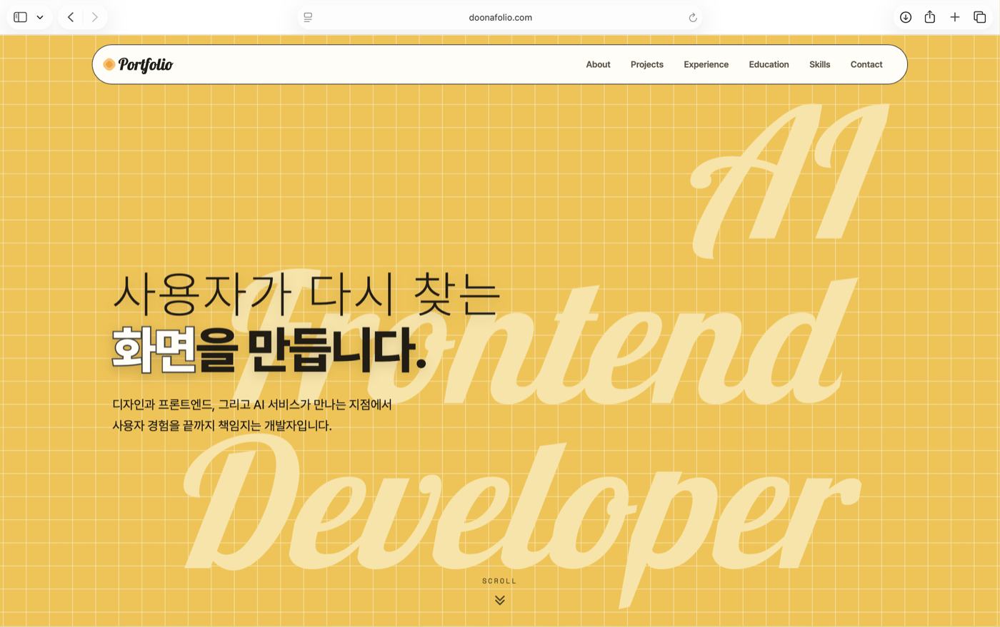

# DOONAFOLIO

**AI Frontend Developer Portfolio**

디자이너 출신 AI 프론트엔드 개발자의 포트폴리오입니다.
프레임워크·빌드 도구 없이 정적 단일 페이지로 구현했으며, 콘텐츠를 받쳐주는
절제된 모션과 가볍고 빠른 코드에 초점을 맞췄습니다.

🔗 **Live**: [doonafolio.com](https://doonafolio.com/)

<a href="https://doonafolio.com/"></a>

## Contents

- [0. About](#0-about)
- [1. Why Vanilla JavaScript](#1-why-vanilla-javascript)
- [2. Features](#2-features)
- [3. Tech Stack](#3-tech-stack)
- [4. Project Structure](#4-project-structure)
- [5. Trouble Shooting](#5-trouble-shooting)
- [6. Deployment](#6-deployment)
- [7. Contact](#7-contact)

## 0. About

디자인 · 프론트엔드 · AI 서비스가 만나는 지점의 프로젝트(LLM·Vision 연동부터
웹·모바일 인터페이스까지)를 소개합니다. 포트폴리오 사이트 자체가 첫 번째
결과물로, 모든 인터랙션을 브라우저 표준 API만으로 구현해 기본기를 그대로
드러냅니다.

## 1. Why Vanilla JavaScript

실무 프로젝트는 React · TypeScript · Flutter로 진행하지만, 이 포트폴리오는
의도적으로 **의존성 없이** 만들었습니다.

- **성능** — 프레임워크 런타임이 없어 로딩과 렌더링이 가볍고 빠릅니다.
- **기본기** — 스크롤 모션, 인플레이스 화면 전환, 디바이스 프레임 쇼케이스를
  `IntersectionObserver` · `requestAnimationFrame` · `<template>` 위에 직접
  구현해, 라이브러리가 아닌 플랫폼에 대한 이해를 보여줍니다.
- **유지보수성** — `:root` 디자인 토큰 시스템으로 색상 · 간격 · radius ·
  타이포그래피를 도구 없이 일관되게 관리합니다.

## 2. Features

- **인터랙티브 프로젝트 쇼케이스** — 브라우저 / 노트북 / 폰 디바이스 프레임으로
  각 프로젝트를 영상 슬라이드쇼로 보여주며, `<template>`을 복제해 우측 패널이
  상세 내용으로 인플레이스 전환됩니다.
- **스크롤 기반 모션** — 섹션 등장, 자동 숨김 내비게이션, 현재 섹션 표시,
  히어로 사인의 글자 단위 등장을 `IntersectionObserver`와
  `requestAnimationFrame`으로 구현했습니다.
- **성능을 고려한 미디어** — 시연 화면 녹화를 GIF 대신 H.264 MP4로 제공해
  용량을 약 87% 줄였고, lazy 로딩으로 페이지를 가볍게 유지합니다.
- **반응형 · 접근성** — `clamp()` 유동 타이포그래피, 모바일 햄버거 메뉴,
  키보드 대응 쇼케이스(ESC · 좌우 화살표 · 포커스 관리), 시멘틱 HTML과 ARIA,
  `prefers-reduced-motion` 대응.

## 3. Tech Stack

### Frontend

HTML5 · CSS3 · Vanilla JavaScript

### Key Features

Semantic markup · Design tokens · Responsive Grid · IntersectionObserver · Event delegation

### Fonts

Pretendard · Lobster · Bricolage Grotesque · Space Mono

### Deployment

GitHub Pages + Cloudflare (Custom domain)

## 4. Project Structure

```
doonafolio/
├── index.html      # 단일 페이지 마크업 (프로젝트 상세는 <template>로 렌더)
├── style.css       # 디자인 토큰 시스템(:root) + 반응형 레이아웃
├── script.js       # 스크롤 모션 · 내비 · 인플레이스 상세 · 미디어 쇼케이스
├── assets/         # 프로젝트별 미디어, 로고, OG 이미지, 파비콘
│   ├── withDOG_assets/
│   ├── On_You_assets/
│   ├── Steam_assets/
│   └── De-registration_web_assets/
├── tools/          # 빌드 없는 미디어 최적화 스크립트 (GIF → MP4)
└── CNAME           # Cloudflare 커스텀 도메인 설정
```

## 5. Trouble Shooting

실제 개발 중 마주친 문제와 해결 과정입니다. 각 사례는 **문제·원인 → 해결 →
결과** 순으로 정리했습니다.

1. 미디어 최적화 — GIF를 H.264 MP4로 최적화 인코딩
2. 모달 메모리 관리 — 지연 로딩과 자원 해제
3. CSS Grid 높이 래칫 디버깅
4. 접근성 — 모달 닫기 버튼과 키보드 내비게이션
5. 히어로 텍스트 애니메이션과 GPU 합성 레이어

### 5.1. 미디어 최적화 — GIF를 H.264 MP4로 최적화 인코딩

**문제 & 원인**
프로젝트 시연을 GIF로 넣었더니 일부 파일이 40~50MB에 달했고, 에셋 전체가
약 473MB였습니다. GIF는 프레임 간 압축이 없고 256색 팔레트의 한계로 화면 녹화
같은 영상형 콘텐츠에 매우 비효율적입니다. 슬라이드를 열 때마다 수십 MB를
내려받아 로딩이 느리고, 정적 호스팅의 대역폭에도 부담이 됩니다.

**해결**
화면 녹화는 프레임 간 차이만 저장하는 H.264(MP4)가 압도적으로 효율적입니다.
GIF를 모두 MP4로 변환하고, 슬라이드를 확장자에 따라 `` / `<video>`로
분기해 렌더했습니다.

```bash
ffmpeg -i demo.gif -c:v libx264 -crf 27 -pix_fmt yuv420p -an demo.mp4
```

```js
// 영상은 <video>로 (음소거·반복·자동재생, 지연 로딩)
var isVid = /\.(mp4|webm)$/i.test(src);
var el = isVid
  ? document.createElement("video")
  : document.createElement("img");
if (isVid) {
  el.muted = el.loop = el.playsInline = true;
  el.preload = "none";
}
```

**결과**

- 에셋 용량 **473MB → 60MB (약 87% 감소)**, 시연 영상 개별 기준 최대 54MB → 6MB 이하 (약 90%+ 감소).
- 슬라이드 로딩이 수십 초에서 수 초로 단축되고 재생이 부드러워졌습니다.
- 콘텐츠 성격(정적 이미지 / 영상)에 맞는 포맷 선택이 성능에 결정적임을
  배웠습니다.

### 5.2. 모달 메모리 관리 — 지연 로딩과 자원 해제

**문제 & 원인**
쇼케이스 모달은 한 프로젝트에 슬라이드가 최대 20장입니다. 처음엔 모든 슬라이드를
바로 로드했는데, 모달을 여러 번 열고 닫으면 디코딩된 미디어가 메모리에 계속
쌓였습니다. 닫아도 DOM의 `src`가 남아 자원이 반환되지 않는 것이 원인이었습니다.

**해결**
보이는 슬라이드만 로드하고(지연 로딩), 모달을 닫을 때 `src`를 비워 브라우저가
메모리를 회수하도록 했습니다.

```js
// 지연 로딩: 첫 장만 즉시, 나머지는 넘길 때 로드
el.dataset.src = src;
if (idx === 0) el.src = src;

// 닫을 때 자원 해제
function closeGal() {
  slideEls.forEach(function (el) {
    el.src = "";
  });
}
```

**결과**

- 초기 로드량이 줄고, 모달을 반복해 열어도 메모리가 누적되지 않습니다.
- "화면에 없는 자원은 들고 있지 않는다"는 원칙을 코드로 적용하는 법을
  익혔습니다.

### 5.3. CSS Grid 높이 래칫 디버깅

**문제 & 원인**
프로젝트 카드를 다시 눌러 상세를 닫아도 섹션 높이가 늘어난 채 줄어들지
않았습니다. 좌(카드)·우(상세) 2단 그리드가 `align-items: stretch`로 높이를
공유하는데, 우측에 `min-height: 100%`가 함께 걸려 있었습니다. 행이 한 번 커지면
`100%`가 그 커진 높이를 다시 참조하는 순환이 생겨, 높이가 고정되는 래칫 현상이
발생한 것입니다.

**해결**
세로 정렬은 `align-items: stretch`가 이미 처리하므로 중복된 `min-height: 100%`만
제거해 순환을 끊었습니다.

```css
/* before: 한 번 커진 높이가 안 줄어듦 */
.projects-aside {
  align-items: center;
  min-height: 100%;
}

/* after: stretch가 정렬 담당 → 정상적으로 축소 */
.projects-aside {
  align-items: center;
}
```

**결과**

- 상세를 닫으면 섹션이 원래 높이로 즉시 복귀합니다.
- 레이아웃 버그는 "어떤 속성이 높이를 결정하는가"를 역추적하면 원인이 보인다는
  점, 중복 속성이 미묘한 부작용을 만들 수 있다는 점을 배웠습니다.

### 5.4. 접근성 — 모달 닫기 버튼과 키보드 내비게이션

**문제 & 원인**
슬라이드 창이 길어지면 닫기(×) 버튼이 화면 위로 잘려 클릭되지 않았습니다.
×가 창(`.shot-wrap`) 바깥 위쪽(`top: -46px`)에 있어, 창이 뷰포트 상단에 닿으면
버튼이 음수 위치로 밀려 화면 밖으로 나가는 것이 원인이었습니다. 또한 마우스
없이 키보드만으로 모달을 다루기 어려웠습니다.

**해결**
×를 모달 최상위로 분리해 창 크기와 무관하게 뷰포트 우상단에 고정하고, 포커스
이동·복귀와 키보드 조작을 추가했습니다.

```js
function openGal() {
  lastFocus = document.activeElement; // 복귀 지점 저장
  closeBtn.focus(); // 포커스를 모달 안으로
}
function closeGal() {
  if (lastFocus) lastFocus.focus();
} // 원위치 복귀

document.addEventListener("keydown", function (e) {
  if (!open) return;
  if (e.key === "Escape") closeGal();
  else if (e.key === "ArrowLeft") goTo(current - 1);
  else if (e.key === "ArrowRight") goTo(current + 1);
});
```

**결과**

- 창 길이와 상관없이 닫기 버튼이 항상 클릭 가능하고, 키보드만으로 열기·탐색·
  닫기가 됩니다.
- "마우스가 없다고 가정하고 흐름을 따라가 보면" 빠진 부분이 드러난다는 점을
  배웠습니다.

### 5.5. 히어로 텍스트 애니메이션과 GPU 합성 레이어

**문제 & 원인**
히어로의 대형 필기체 사인이 글자 단위로 등장할 때 (a) 배경 격자가 사라지고
(b) 글자에 잔상(ghosting)이 남았습니다. 대형 텍스트에 `transform` 애니메이션을
주면 브라우저가 별도 GPU 합성 레이어를 만드는데, 그 과정에서 `body` 배경(격자)이
다시 그려지지 않거나 글리프에 잔상이 남는 합성(compositing) 이슈였습니다.

**해결**
배경 격자를 `body::before` 고정 레이어로 분리해 콘텐츠와 독립시키고, 글자
애니메이션을 `transform` 대신 `opacity` 전환만 사용하도록 단순화했습니다.

```css
/* 배경을 독립 고정 레이어로 분리 (모션에 영향받지 않음) */
body::before {
  content: "";
  position: fixed;
  inset: 0;
  z-index: -1;
  background-image: linear-gradient(...);
}

/* 글자: transform 대신 opacity만 + 레이어 안정화 */
.hero-sign .ch {
  opacity: 0;
  animation: charin 0.4s ease forwards;
  backface-visibility: hidden;
}
```

**결과**

- 격자가 항상 유지되고 글자 등장이 잔상 없이 매끄러워졌습니다.
- 화려한 효과보다 "브라우저가 언제 무엇을 다시 그리는가(repaint · compositing)"를
  이해하는 것이 부드러운 모션의 핵심임을 배웠습니다.

<details>
<summary><b>기타 개선 내역</b> (펼치기)</summary>

<table>
<thead><tr><th>증상</th><th>원인</th><th>해결</th></tr></thead>
<tbody>
<tr><td>스크롤 안내가 등장 직후 깜빡(밝기 점프)</td><td>등장(<code>cuein</code>) 종료 opacity와 호흡(<code>cuefloat</code>) 시작 opacity 불일치</td><td>두 애니메이션 이음새의 opacity 값을 동일하게 맞춰 매끄럽게 연결</td></tr>
<tr><td>프로젝트 상세가 모달처럼 떠서 흐름이 끊김</td><td>별도 모달 레이어로 콘텐츠를 띄우는 구조</td><td>카드의 <code>&lt;template&gt;</code> 내용을 우측 패널에 <code>cloneNode</code>로 인플레이스 렌더</td></tr>
<tr><td>About 우측(Currently·Focus)이 좌측 본문과 라인이 안 맞음</td><td>우측 컬럼이 단순 정렬이라 본문 높이와 어긋남</td><td>2단 그리드 <code>align-items:stretch</code> + <code>justify-content:space-between</code>, 메타라인 <code>margin-top:auto</code>로 하단 고정</td></tr>
<tr><td>카드 좌우 여백이 섹션마다 불일치</td><td>본문 카드와 푸터 카드의 <code>.wrap</code> 적용 방식이 달라 여백 차이</td><td>카드 <code>max-width</code>를 <code>calc(var(--maxw) - 60px)</code>로 통일하고 섹션 좌우 패딩 부여</td></tr>
<tr><td>긴 문장·'Team Project' 사인이 좁은 화면에서 컬럼을 넘침</td><td>전 구간 <code>white-space:nowrap</code> + <code>vw</code> 폰트가 컬럼 폭 초과</td><td>넓은 화면에서만 한 줄 고정, 그 이하는 줄바꿈 + <code>clamp</code>로 축소해 2단 유지</td></tr>
</tbody>
</table>

</details>

## 6. Deployment

GitHub Pages로 호스팅하고, Cloudflare DNS를 통해 커스텀 도메인
`doonafolio.com`에 연결했습니다. 정적 파일을 그대로 서빙하므로 별도의 빌드나
서버가 필요 없습니다.

```bash
# 로컬 실행
python3 -m http.server 8000
# → http://localhost:8000
```

배포 절차

1. 저장소에 push
2. **Settings → Pages → Source: Deploy from a branch → `main` / `(root)`**
3. Cloudflare에서 도메인 DNS를 GitHub Pages로 연결 (`CNAME` 파일에 커스텀 도메인 명시)

## 7. Contact

- **Email**: doona0429@gmail.com
- **GitHub**: [github.com/oooonbbo-wq](https://github.com/oooonbbo-wq)
